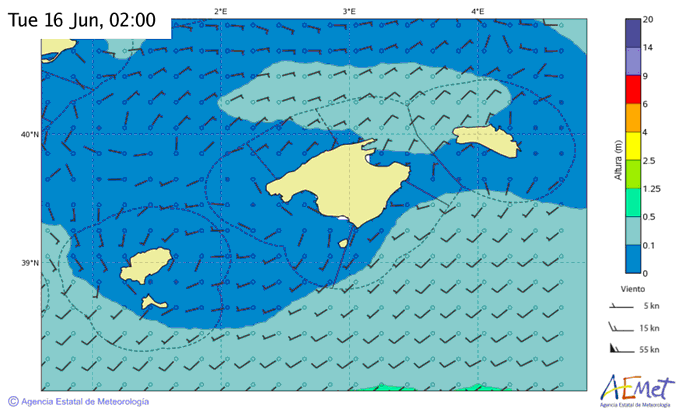

# AEMET

Repository to get [© AEMET](http://www.aemet.es) weather predictions and publish them on telegram channels.

## Why?

To be able to access this information in areas of low mobile coverage or itinerant mobile coverage.

For more information see [github.com/xiscocapllonch/maritime-forecast-bot](https://github.com/xiscocapllonch/maritime-forecast-bot).

## Installation

```shell
go get github.com/xiscocapllonch/aemet
```

## Forecast Usage

You must find the xmlId for the area you want. In this case for the Balearic Islands: "FQXX44MM".

For other areas [browse the official website](http://www.aemet.es/en/eltiempo/prediccion/maritima?opc1=0&opc2=martot&opc3=1&area=bal1) and inspect the XML download button.

```golang
package main

import (
    "github.com/xiscocapllonch/aemet"
    "log"
)

func main() {
    forecastText, err := aemet.GetMaritimeForecast("FQXX44MM")
	
    if err != nil {
		log.Fatal(err)
	}
    
    log.Println(forecastText)
}
```

Forecast text example:

```html
<u><b>Avisos válidos hasta el miércoles, 17 junio 2020 a las 12:00 hora oficial</b></u>

No hay avisos


<u><b>Situación General Illes Balears</b></u>

Fecha de inicio: martes, 16 junio 2020 a las 12:00 hora oficial
Fecha de fin: miércoles, 17 junio 2020 a las 12:00 hora oficial

Bajas presiones de 1012 en Liguria y altas presiones de 1024 al oeste del Estrecho con pocos cambios.


<u><b>Predicción</b></u>

Fecha de inicio: martes, 16 junio 2020 a las 12:00 hora oficial
Fecha de fin: miércoles, 17 junio 2020 a las 12:00 hora oficial


<b>Aguas costeras de Menorca</b>

• <b>Norte de Menorca</b>: E y NE 2 a 4. Marejadilla. Temporalmente mar de fondo del N de 1 m.
• <b>Sur de Menorca</b>: Componente E 2 a 3. Marejadilla.

<b>Canal de Menorca</b>

Componente E 2 a 4. Marejadilla.

<b>Aguas costeras de Mallorca</b>

• <b>Noroeste de Mallorca (de Dragonera a Formentor)</b>: E y NE 2 a 4. Marejadilla ocasionalmente marejada por la tarde.
• <b>Nordeste de Mallorca (de Formentor a Capdepera)</b>: Componente E 2 a 4. Marejadilla.
• <b>Este de Mallorca (de Capdepera a Salinas)</b>: E y SE 3 temporalmente variable 2 a 3 por la noche. Marejadilla. Posibles bancos de niebla de madrugada.
• <b>Sur de Mallorca (de Salinas a Dragonera)</b>: Componente S 3 a 4 amainando a variable 2 a 3 por la tarde. Marejadilla ocasionalmente marejada por la tarde. Posibles bancos de niebla de madrugada.

<b>Aguas costeras de Cabrera</b>

Variable 2 a 3. Marejadilla. Posibles bancos de niebla de madrugada.

<b>Canal de Mallorca</b>

Componente S 3 a 4 amainando a variable 2 a 3 por la tarde. Marejadilla.

<b>Aguas costeras de Ibiza</b>

Variable 2 a 3. Marejadilla.

<b>Aguas costeras de Formentera</b>

Componente W 3 a 4 tendiendo a componente E de madrugada. Marejadilla con áreas de marejada por la tarde.


<u><b>Tendencia</b></u>

Fecha de inicio: miércoles, 17 junio 2020 a las 12:00 hora oficial
Fecha de fin: jueves, 18 junio 2020 a las 12:00 hora oficial

No se esperan condiciones de aviso en ninguna zona


© AEMET
```

## Forecast Maps Usage

You must find the zoneCode for the area you want. In this case for the Balearic Islands: "ecwam_bal".

For other areas [browse the official website](http://www.aemet.es/en/eltiempo/prediccion/maritima?opc1=0&opc2=martot&opc3=0&area=bal1) and inspect the image address.

If you want the wave map "wind = false", if you want the wind map "wind = true".

```golang
package main

import (
    "github.com/xiscocapllonch/aemet"
    "log"
)

func main() {

   gif, err := aemet.GetMaritimeForecastMapGIF("ecwam_bal", 24, 150, true)
   
   	if err != nil {
   		log.Fatal(err)
   	}

    // use gif
}
```

Forecast map example:

